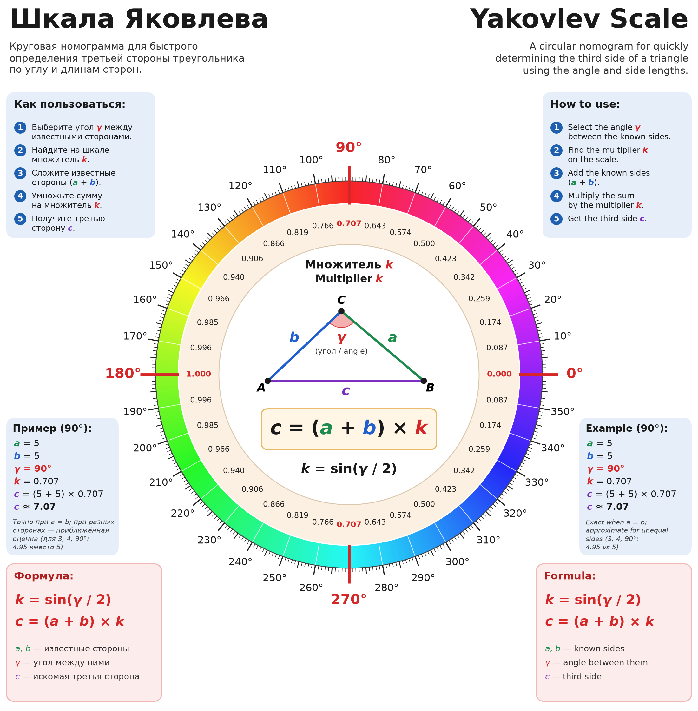
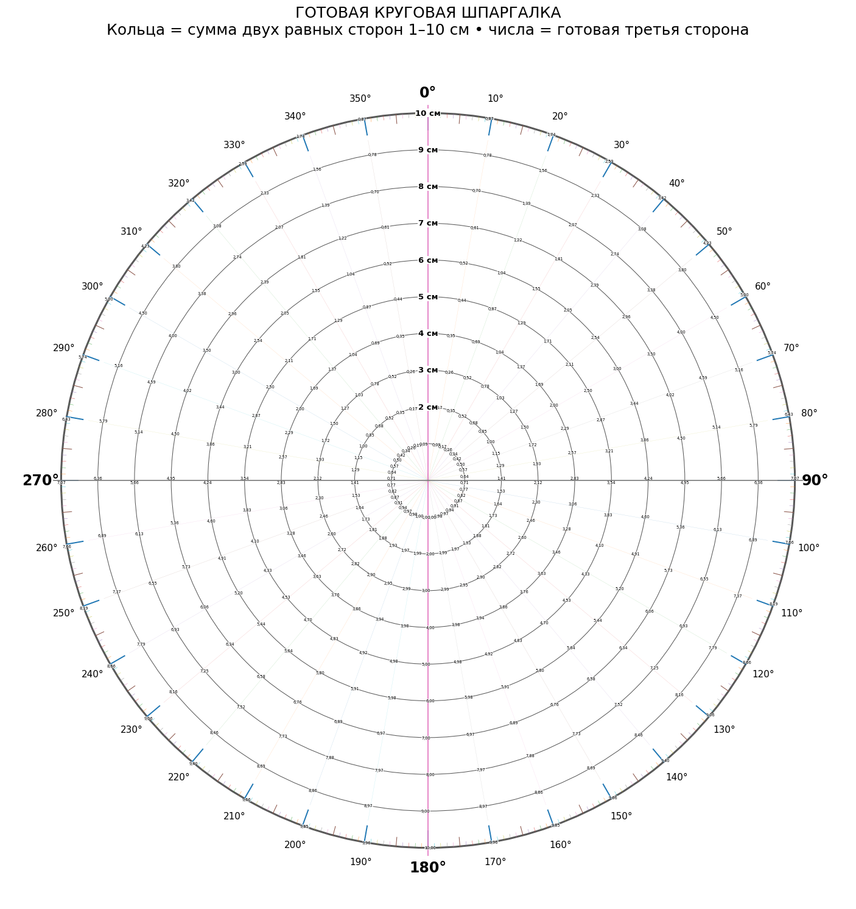
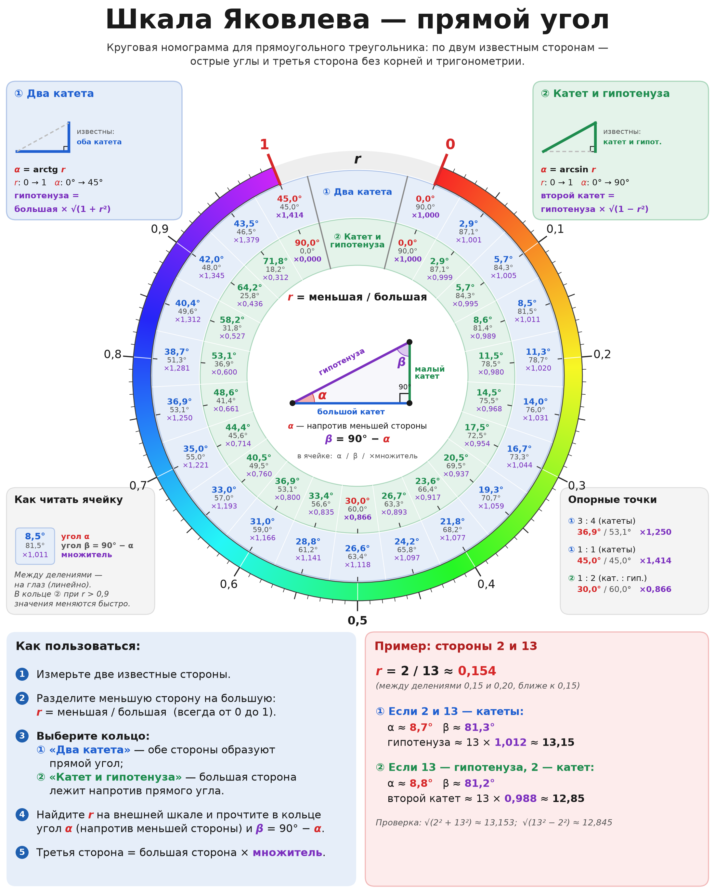
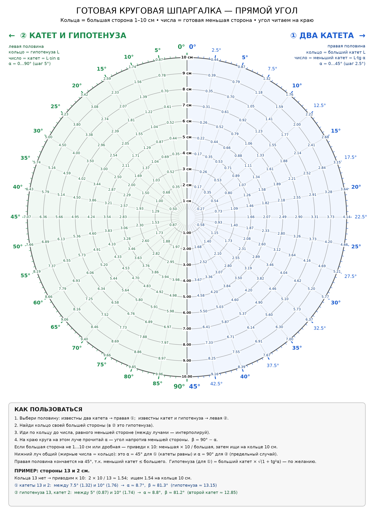

# Шкала Яковлева / Yakovlev Scale

Шкала Яковлева — круговая номограмма для быстрого определения третьей стороны треугольника по двум известным сторонам и углу между ними.

Yakovlev Scale is a circular nomogram for quickly determining the third side of a triangle from two known sides and the angle between them.

$$c = (a + b) \cdot k, \qquad k = \sin(\gamma / 2)$$

## Основа / Basis

Шкала Яковлева — удобная шпаргалка на основе классической формулы длины хорды: для двух равных сторон $a$ третья сторона равна $c = 2a \sin(\gamma/2)$. Таблицы хорд известны со времён Птолемея (II век н. э.), а номограммы для треугольников широко применялись до появления калькуляторов. Новое здесь — не математика, а подача: наглядная круговая шкала и готовая таблица, по которым третью сторону можно прикинуть без синусов и корней.

The Yakovlev Scale is a practical cheat sheet based on the classic chord-length formula: for two equal sides $a$, the third side is $c = 2a \sin(\gamma/2)$. Chord tables date back to Ptolemy (2nd century AD), and triangle nomograms were widely used before calculators. What is new here is not the mathematics but the presentation.

Сайт / Website: https://shkalayakovleva.github.io/

## 1. Шкала Яковлева (цветная номограмма)

По кругу отложены углы от 0° до 360°, и против каждого угла стоит готовый множитель $k = \sin(\gamma/2)$.

Как пользоваться:

1. Найдите угол между известными сторонами.
2. Возьмите на шкале множитель $k$ напротив этого угла.
3. Сложите известные стороны: $a + b$.
4. Умножьте сумму на множитель.
5. Получится третья сторона: $c = (a + b) \cdot k$.

Синусы и корни считать не нужно, хватит одного сложения и одного умножения.

Для равнобедренного треугольника ($a = b$) результат точный. Если стороны разные, шкала даёт немного заниженную оценку, и чем сильнее различаются стороны, тем больше погрешность. При сторонах 3 и 4 и угле 90° шкала даёт 4,95 вместо точных 5, это около 1%. Шкала подходит для прикидок в столярке, раскрое, разметке и на уроках геометрии, где скорость важнее третьего знака после запятой.

**Пример:** $a = 5$, $b = 5$, $\gamma = 90°$, $k = 0{,}707$, $c = (5 + 5) \cdot 0{,}707 \approx 7{,}07$.

## 2. Готовая круговая шпаргалка

Рабочая таблица по шкале Яковлева, где уже ничего не нужно умножать. Каждое кольцо соответствует сумме двух равных сторон, от 1 до 10 см. Лучи показывают угол между сторонами, от 0° до 360°. На пересечении кольца и луча написана готовая длина третьей стороны.

Например, у двух сторон по 5 см (кольцо «10 см») с углом 90° третья сторона равна 7,07 см.

Правая половина круга (0°–180°) основная, левая (180°–360°) зеркальная: углы γ и 360° − γ дают одно и то же число. Внизу листа есть краткая инструкция и пример.

Шпаргалка точна для равнобедренных треугольников и удобна, когда нужно быстро найти хорду, раствор циркуля или расстояние между концами двух одинаковых планок под заданным углом. Её можно распечатать и держать у рабочего места.

## Как читать / How to read

Две картинки читаются по-разному, не путайте их.

1. **Цветная шкала** даёт **множитель** $k$, а не длину. Его нужно умножить на сумму сторон $a + b$. При угле 120° $k = 0{,}866$.
2. **Круговая шпаргалка** даёт **готовую третью сторону** для суммы, написанной на кольце. Умножать ещё раз не нужно. Если ваша сумма $S$ другая, пересчитайте: число × $S$ / кольцо.

**Пример:** угол 120°, кольцо «7 см» → 6,06 (это 7 × 0,866). Это уже третья сторона для суммы 7 см. Для суммы 17 см: 17 × 0,866 ≈ 14,7, или по шпаргалке 6,06 × 17 / 7 ≈ 14,7. Ошибка: умножить 6,06 на 17 (получится 103, это неверно).

Формула точна только при $a = b$. Если стороны разные, результат немного занижен.

The two pictures are read differently:

1. **Colour scale** gives a **multiplier** $k$, not a length. Multiply it by the sum $a + b$. At 120°, $k = 0.866$.
2. **Circular cheat sheet** gives the **ready third side** for the sum written on the ring. Do not multiply again. For a different sum $S$, rescale: value × $S$ / ring.

**Example:** 120°, ring "7 cm" → 6.06 (= 7 × 0.866), already the third side for a sum of 7 cm. For a sum of 17 cm: 17 × 0.866 ≈ 14.7, or 6.06 × 17 / 7 ≈ 14.7. Wrong: 6.06 × 17 = 103.

The formula is exact only when $a = b$; for unequal sides it slightly underestimates.

---

## 3. Прямой угол / Right angle

Две картинки для любого прямоугольного треугольника: по двум известным сторонам найти острые углы и третью сторону. Здесь нет допущения $a = b$, результат точен в пределах точности чтения шкалы.

**Цветная номограмма.** Разделите меньшую сторону на большую: $r$ = меньшая / большая (от 0 до 1), найдите $r$ на внешнем цветном кольце и прочитайте ячейку своего кольца:

- кольцо ① «Два катета»: $\alpha = \operatorname{arctg} r$;
- кольцо ② «Катет и гипотенуза»: $\alpha = \arcsin r$.

$\alpha$ — острый угол напротив меньшей стороны, $\beta = 90° - \alpha$. Третья сторона = большая сторона × множитель из ячейки (① $\sqrt{1 + r^2}$ — гипотенуза, ② $\sqrt{1 - r^2}$ — второй катет).

**Готовая шпаргалка.** Кольца — большая сторона 1–10 см, числа — готовая меньшая сторона, угол $\alpha$ читается на краю круга. Правая половина — ① «Два катета» ($\alpha$ от 0° до 45°), левая — ② «Катет и гипотенуза» ($\alpha$ от 0° до 90°). Если большая сторона больше 10 см или дробная, приведите её к 10: меньшая × 10 / большая, и ищите на кольце 10.

**Пример:** стороны 2 и 13, $r = 2 / 13 \approx 0{,}154$ (на шпаргалке: 2 × 10 / 13 ≈ 1,54 на кольце 10).

- Катеты 13 и 2: $\alpha \approx 8{,}7°$, $\beta \approx 81{,}3°$, гипотенуза ≈ 13 × 1,012 ≈ 13,15.
- Гипотенуза 13 и катет 2: $\alpha \approx 8{,}8°$, $\beta \approx 81{,}2°$, второй катет ≈ 13 × 0,988 ≈ 12,85.

Two pictures for any right triangle: from two known sides, find the acute angles and the third side (no $a = b$ assumption). **Colour nomogram:** compute $r$ = smaller / larger side, find it on the outer colour ring and read your ring: ① two legs, $\alpha = \arctan r$; ② leg and hypotenuse, $\alpha = \arcsin r$. $\alpha$ is opposite the smaller side, $\beta = 90° - \alpha$; third side = larger side × the multiplier in the cell. **Ready cheat sheet:** rings = larger side 1–10 cm, numbers = ready smaller side, read $\alpha$ at the edge; right half = two legs (0–45°), left half = leg and hypotenuse (0–90°). For a larger side over 10 cm, scale to 10: smaller × 10 / larger.

**Example:** sides 2 and 13. Legs: $\alpha \approx 8.7°$, $\beta \approx 81.3°$, hypotenuse ≈ 13.15. Hypotenuse 13 and leg 2: $\alpha \approx 8.8°$, $\beta \approx 81.2°$, other leg ≈ 12.85.

---

Автор визуального представления: Владимир Яковлев, 2026.  
Yakovlev Scale visual representation: Vladimir Yakovlev, 2026.
